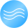

# Sea

[guide](doc/guide.md) - [samples](samples/)

> _C for the modern world._

> _Pronounced \[see-uh\] (IPA: /siə/)_

---

Sea is a general-purpose language made to allow programmers to write low-level,
performant, and portable code without needing to write C.

**Features:**

- 100% interoperability with C. All C libraries can be cleanly used in Sea, and vice-versa too.
  - C interoperability is also completely overhead-free!
- As little ambiguity as possible (except in the pronunciation of Sea and C, whoops).
- Equally as fast as C since Sea gets transpiled to C.

**Inspired By:**

- C, obviously
- [Odin](https://odin-lang.org)
- [V](https://vlang.io)
- [Cyclone](https://cyclone.thelanguage.org), partially
- [Go](https://go.dev)

## Usage

At the moment, Sea is not in a feature-complete state, however if you want to
try it, you can build the compiler using `cargo build --release`.

To build Sea code, use `sea compile --run ./path/to/input.sea` (or
`sea c -r ./path/to/input.sea`).

## Why?

I simply enjoy writing languages! :P

For a more "real" reason: I love writing C, however I also like modern syntax
and a more... usable standard library.

> C's stdlib is absolutely usable, however a modern stdlib designed around
> modern practices is significantly more usable than a stdlib designed around
> code practices from the 70s.

Of note, the Sea standard library can be 100% ignored and you can use solely the
C standard library if you wish. Or you can also use no standard libraries, if
you so chose.

## Developers and Contributors

Read this! [doc/developers.md](doc/developers.md)

## License

MIT License, see [here](license.txt) for license text.
